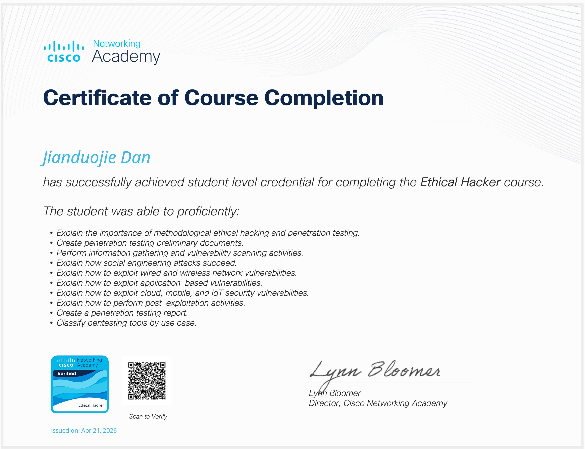
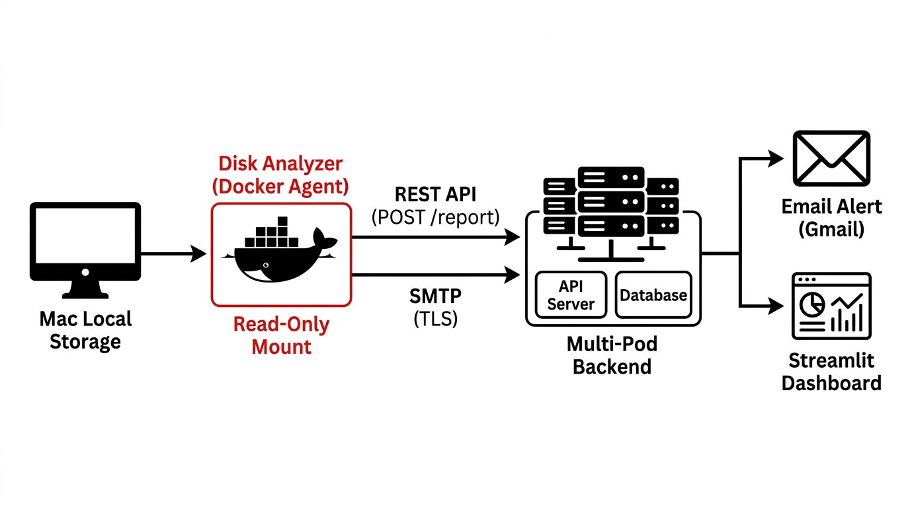
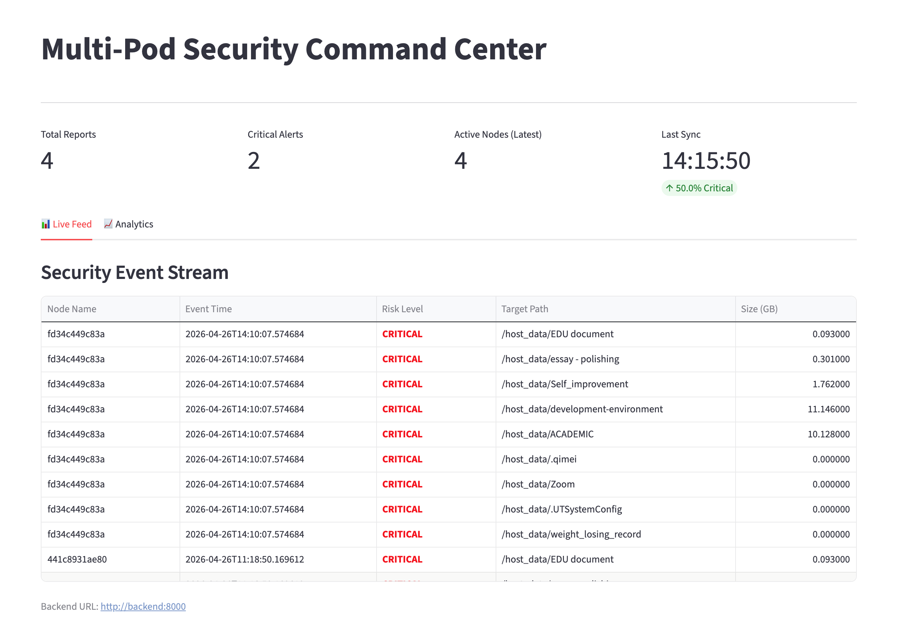
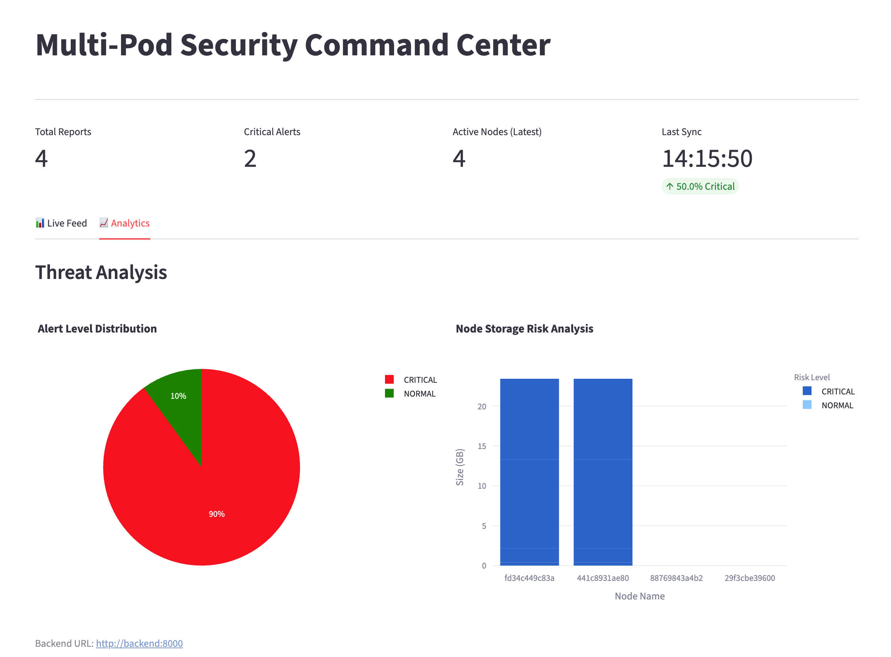
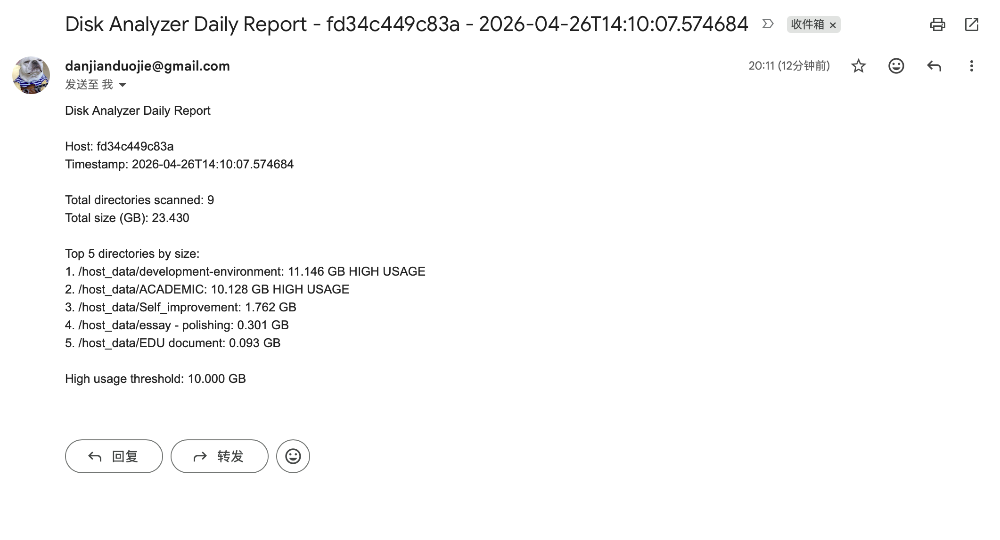

# Disk Analyzer

**🏅 Certification:** 



## 1. Project Description & Problem it Solves
**Disk Analyzer** is a lightweight, containerized storage monitoring agent. It addresses the common problem of unmonitored disk space bloat on personal computers and servers. Users often accumulate large, forgotten files or development environments that consume massive amounts of disk space. 

This utility autonomously scans specified local directories, identifies the largest storage consumers, and flags any directories exceeding a defined "High Usage" threshold (e.g., 5GB). It solves the lack of visibility into disk consumption by providing daily summary alerts via Email and seamlessly pushing the parsed data to a centralized **Multi-Pod Security Command Center** for real-time dashboard visualization.

## 2. Architecture Overview



The system follows a decoupled, microservice-inspired architecture based on the Principle of Least Privilege:
*   **The Agent (Disk Analyzer):** A standalone Python script running in an ephemeral Docker container (`--rm`). It mounts the host machine's directories as **Read-Only (`:ro`)** to guarantee absolute safety against accidental data deletion.
*   **Email Notification:** Uses the native `smtplib` over TLS to dispatch daily text-based summary reports to the user's Gmail.
*   **Data Pipeline:** The agent formats the scan results into a JSON payload and makes an HTTP POST request to the Multi-Pod FastAPI Backend.
*   **Centralized Dashboard:** The Multi-Pod backend stores the incoming data in SQLite, which is then visualized by a Streamlit frontend interface (showing Live Feeds and Threat Analysis).

## 3. Tech Stack
*   **Language:** Python 3.12
*   **Core Libraries:** `os` (file system traversal), `requests` (HTTP communication), `smtplib` / `email.message` (SMTP mailing)
*   **Containerization:** Docker (Python slim image for a minimal footprint)
*   **Integration:** FastAPI (Backend API Receiver), Streamlit (Frontend Dashboard Visualization)

## 4. Setup & Run Instructions

### Prerequisites
*   Docker Desktop installed and running.
*   A Gmail account with an "App Password" generated for secure SMTP access.
*   The Multi-Pod Backend running locally (e.g., on port 8000).

### Running via Docker
Run the following command in your terminal. Replace `your_email@gmail.com` and `your_app_password` with your actual credentials:

```bash
docker run --rm \
  -v /Users/Zhuanz/Documents:/host_data:ro \
  -e SCAN_ROOTS=/host_data \
  -e MULTIPOD_BACKEND_URL=http://host.docker.internal:8000 \
  -e EMAIL_USER=your_email@gmail.com \
  -e EMAIL_PASSWORD="your_app_password" \
  -e EMAIL_TO=your_email@gmail.com \
  disk-analyzer:latest
```
*(Note: For macOS users, a `.command` executable script has been provided locally for one-click execution, but is ignored via `.gitignore` to prevent credential leaks).*

## 5. Screenshots & Diagrams
### Live Security Feed (Multi-Pod Dashboard)
*(Shows the Disk Analyzer nodes reporting `CRITICAL` high usage paths)*


### Threat Analysis & Storage Risk
*(Shows the data visualization of the storage risk analysis)*


### Email Alert
*(Shows the daily summary report sent directly to the user's inbox)*


---

## 6. Pitch Presentation
*   **Slides:** [Link to Presentation Slides (PDF/PPTX) - TBA]

## 7. Demo Video
*   **Video Link:** [YouTube / Google Drive Link - TBA]

## 8. Faculty Feedback
*   **Feedback Video:** [YouTube / Google Drive Link - TBA]
